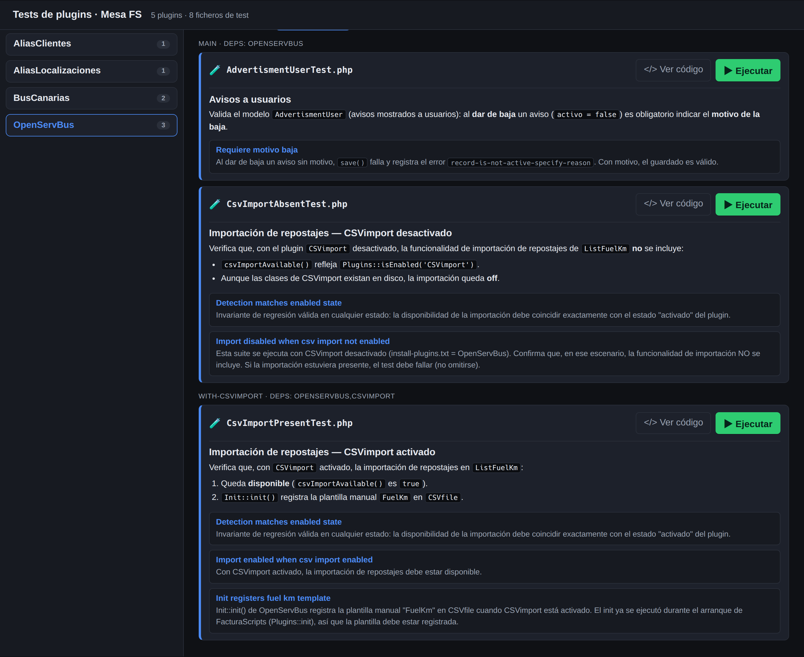
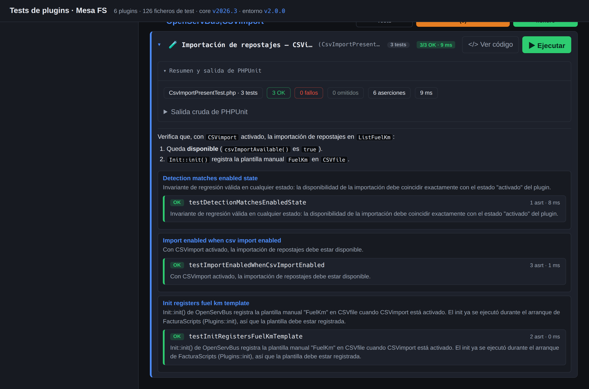

# fs-test-env

Tooling reutilizable para montar un **entorno de pruebas de FacturaScripts** (PHPUnit) y
ejecutar los tests de los plugins, con un **runner web** navegable — sin tocar la instalación ni
la base de datos de trabajo del proyecto.

Pensado para montarse como **submódulo git** (`test-bin/`) en cualquier proyecto FacturaScripts.
No contiene ningún valor específico de un proyecto: la configuración del despliegue se genera con
`init-project.sh` en un fichero `.fs-test-env.env` del proyecto.

## Capturas

Listado de tests con la descripción markdown (`@description`) de cada clase y sus métodos:



Resultados de una ejecución (resumen + estado y descripción por caso):



## Contenido

- `bin/init-project.sh` — genera `.fs-test-env.env` y renderiza el vhost apache y el servicio
  compose desde `templates/`.
- `bin/test-env-provision.sh` — provisión no interactiva: clona/actualiza el core, `composer
  install`, crea la BD de pruebas, enlaza los plugins, construye el esquema (warm-up) y deja el
  entorno con todos los plugins **desactivados**. Genera dentro del core de pruebas
  `warmup-schema.php`, `phpunit-webrunner.xml` y un `Test/install-plugins.php` que **sincroniza**
  al conjunto exacto de `Test/Plugins/install-plugins.txt` (activa/desactiva) — así funcionan los
  tests de *ausencia* de un plugin.
- `bin/setup-test-env.sh` — front interactivo para el host (deps, prompts) que delega en la provisión.
- `bin/plugin-topo-order.php` — ordena plugins por sus dependencias `require`.
- `web/` — runner web (PHP plano + JS): lista los plugins con tests, muestra la **descripción
  markdown** (`@description`) de cada test y ejecuta las suites mostrando los resultados.
- `templates/` — plantillas del vhost apache y del servicio compose, con placeholders `@@VAR@@`.
- `config.env.example` — todas las variables del despliegue, documentadas.

## Cómo montarlo en un proyecto FacturaScripts

```bash
# 1) añadir como submódulo
git submodule add git@github.com:Asermar/fs-test-env.git test-bin

# 2) generar la configuración del despliegue (interactivo)
test-bin/bin/init-project.sh
#    -> crea .fs-test-env.env  y  .fs-test-env/{test.conf,service.yaml}

# 3) integrar en tu compose el servicio de .fs-test-env/service.yaml y levantarlo
#    podman-compose up -d <servicio>     # si CONTAINER_ENGINE=podman
#    docker compose up -d <servicio>     # si CONTAINER_ENGINE=docker
#    (monta .fs-test-env/test.conf como sitio apache del contenedor)

# 4) provisionar el entorno
test-bin/bin/setup-test-env.sh          # en el host (interactivo)
#    o dejar que el contenedor lo haga al arrancar (TESTENV_AUTO_PROVISION=1)
```

### Podman o Docker

`init-project.sh` pregunta el motor (`CONTAINER_ENGINE`, def. `podman`) y renderiza el
servicio desde la plantilla correspondiente:

- **podman**: incluye `userns_mode: keep-id` y el sysctl de puertos no privilegiados
  (necesarios en podman rootless para ligar el 80).
- **docker**: sin esas claves (el contenedor arranca como root y liga el 80). En Docker
  rootful, si los ficheros que el contenedor escribe en `test-env/` te dan problemas de
  permisos, ejecuta el servicio con `user: "UID:GID"` de tu usuario.

El resto del servicio (red, volúmenes, comando de provisión, labels de traefik) es idéntico.

## Configuración

Prioridad de lectura: **variables de entorno** → `<proyecto>/.fs-test-env.env` → **defaults**.
Variables principales (ver `config.env.example`): `FS_CORE_DIR` (layout del core: `src` o `.`),
`TESTENV_REPO_PATH` (ruta absoluta idéntica host/contenedor), `TEST_DB`, `CORE_REPO`/`CORE_BRANCH`,
`FS_LANG`/`FS_TIMEZONE`, `TEST_WEB_TITLE`, y las de contenedor/red/proxy (`TESTENV_*`).

**Versión del core (`CORE_BRANCH`)**: acepta una **rama** o un **tag** de versión. Si se deja
vacío, el provisionador usa el **tag de la versión instalada** (`v<Kernel::version()>`, p.ej.
`v2026.3`), con fallback a `master`. El provisionador interactivo (`setup-test-env.sh`) ofrece,
además de la instalada, las **5 versiones (tags) más recientes** del repo de origen.

## Ejecutar los tests

- Web: el host configurado en `TESTENV_HOST` (runner navegable).
- CLI: `cd <TESTENV_DIR> && vendor/bin/phpunit Plugins/<Plugin>/Test`.

## Versión del entorno

El tooling se versiona con el fichero **`VERSION`** (semver) en la raíz del repo, replicado en
un **tag** `vX.Y.Z` por release. La web lo muestra en la cabecera (`entorno vX.Y.Z`).

Para saber si los scripts instalados están al día respecto al remoto:

```bash
test-bin/bin/version.sh
#  Entorno de test instalado: v1.0.0
#  Entorno de test remoto:    v1.0.1
#  => Hay una versión más reciente (v1.0.1). Actualiza el submódulo test-bin: ...
```

Al hacer cambios en el tooling, sube el número de `VERSION` y crea el tag correspondiente.

## Convención de descripciones de test

Cada `*Test.php` puede documentar clase y métodos con un bloque `@description` (markdown) en su
docblock; si no lo tiene, se usa el propio docblock como descripción. El runner web lo renderiza.
